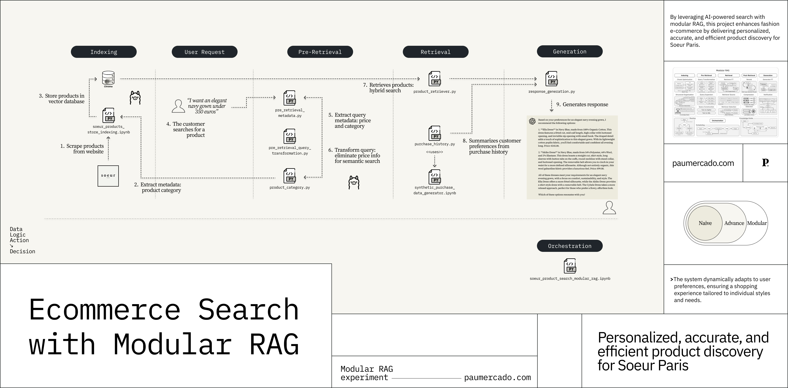

# Soeur Paris E-commerce Search Experiment (Modular RAG)

This repository contains an experimental Retrieval-Augmented Generation (RAG) pipeline designed to enhance product search for the French fashion brand Soeur Paris. The project explores modular RAG components to personalize and refine product search results based on customer purchase history, metadata extraction, and vector database retrieval.

## The solution

## Experiment overview

The goal of this experiment is to improve e-commerce search using LLM-based metadata extraction and personalized search recommendations. The system consists of:
* Product data scraping & indexing in ChromaDB for efficient retrieval.
* Structured metadata extraction from search queries (e.g., price filtering, category classification).
* Customer purchase history analysis to infer user preferences and personalize recommendations.

## Experiment description

This project serves as a **real-world implementation of the modular RAG principles** discussed in [Modular RAG: Transforming RAG Systems into LEGO-like Reconfigurable Frameworks](https://arxiv.org/html/2407.21059v1), specifically in the context of **fashion e-commerce search for Soeur Paris**. By leveraging a **modular architecture**, this system enhances **retrieval-augmented generation (RAG)** performance in several key ways:

1. **Improved Search Accuracy:**

* By **structuring search queries** (e.g., extracting price filters, product categories, and customer preferences), the system refines the search before retrieval occurs.
* This approach **reduces ambiguity** and ensures that product recommendations are **aligned with user intent**.

2. **Personalization with User Context:**

* The **purchase history module** enables the system to **prioritize products** that match a user’s past preferences, such as **styles, colors, and price ranges**.
* This aligns with the paper’s argument that **personalized retrieval improves user engagement** and enhances **conversion rates** in e-commerce.

3. **Hybrid Retrieval for Scalability:**

* The system first **filters** products using structured metadata (**fast and efficient**) and then performs **vector-based similarity search** via **ChromaDB**.
* This two-step approach **minimizes unnecessary embedding lookups**, improving retrieval **speed and efficiency**, as advocated in the paper.

4. **Modular & Extensible RAG Architecture:**

* Each module (**metadata extraction, product retrieval, user personalization**) operates **independently**, allowing the system to be easily **extended or modified**.
* New features, such as **trend-based recommendations** or **real-time fashion insights**, can be added **without disrupting the core pipeline**.

## Configuration of the modular RAG architecture

The config.py file provides configuration flags that control the different components of the modular RAG architecture. Here’s how it enables or disables various functionalities:

1. **enable_purchase_history (True/False)**

•  When **True**, the system **incorporates customer purchase history** to personalize search results.

•  When **False**, the search results are based only on the query and product database, without personalization.

2. **enable_metadata_extraction (True/False)**

•  When **True**, the system **extracts structured metadata** (e.g., price filters, product categories) from the query to improve retrieval.

•  When **False**, the search is performed without structured metadata.

3. **enable_query_transformation (True/False)**

•  When **True**, the system **modifies the user’s query** to remove unnecessary information (e.g., removing price details when filtering is applied separately).

•  When **False**, the query is used as is, without modifications.

### How it works in the RAG pipeline

Each module in the RAG architecture checks the respective flag from config.py before executing. This allows:

* **Dynamic customization** without modifying the core code.
* **Flexibility** to test different configurations for **performance evaluation**.
* **Easy experimentation** by toggling features **on or off** based on business requirements.

## Repository Structure

📂 ecommerce-search-modular-rag
│── 📄 README.md                 # Project documentation
│── 📓 soeur_product_search_modular_rag.ipynb    # Main notebook for modular RAG search
│── 📓 soeur_products_store_indexing.ipynb       # Web scraper & product indexing in ChromaDB
│── 📓 synthetic-purchase-data-generator.ipynb   # Generates synthetic purchase history data
│── 📄 config.py        # Flags to enable the different modules of the RAG architecture
│── 📄 purchase_history.py        # Extracts customer preferences from purchase history
│── 📄 product_category.py        # Classifies product queries into predefined categories
│── 📄 product_retriever.py       # Defines the product search query structure
│── 📄 metadata_extraction.py     # Extracts structured metadata (price, category, comparison)
│── 📂 chroma_products_souer/                      # Stores extracted product data & synthetic customer data

## Main Components

### 📓 1. soeur_product_search_modular_rag.ipynb (Main Notebook)

This is the core notebook that orchestrates the modular RAG-based product search: 
* Parses user queries to extract structured metadata (price, category, etc.).
* Searches for relevant products in ChromaDB (vector database).
* Personalizes results based on past purchase history (if available).

### 📓 2. soeur_products_store_indexing.ipynb (Product Data Scraper & Indexer)
* Scrapes product data from the Soeur Paris website.
* Extracts product attributes (name, description, price, category, etc.).
* Indexes the product dataset into ChromaDB for retrieval.

### 📓 3. synthetic-purchase-data-generator.ipynb (Customer Data Generator)
* Generates synthetic purchase history for test customers.
* Simulates real-world customer buying behavior (e.g., purchase frequency, product preferences).
* Used for testing the purchase history personalization module.

## Python Modules

### 📄 purchase_history.py
* Extracts customer fashion preferences from their purchase history.
* Identifies styles, colors, fabrics, fit, and budget preferences.
* Helps personalize search responses.

### 📄 metadata_extraction.py
* Extracts price filters, comparison operators, and product categories from user queries.
* Uses Llama3.2 to process natural language inputs into structured data.

### 📄 product_category.py

* Classifies **fashion search queries** into predefined categories (e.g., Dresses, Shoes, Bags).
*  Ensures structured **category-based filtering**.

### 📄 product_retriever.py

* Defines the ProductQuery class, which standardizes **search query representation**.
* Stores **metadata extracted from queries** (price, category, preferences).